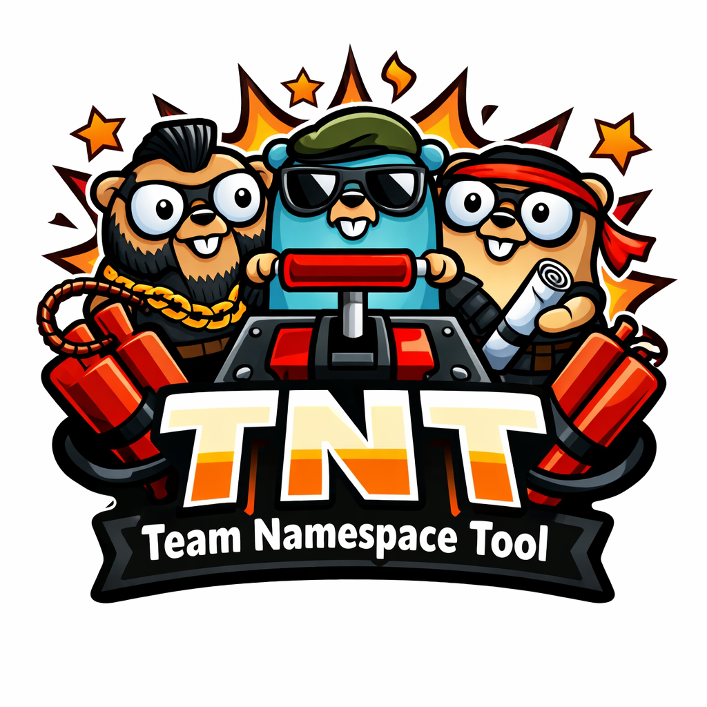

<h1 style="text-align: center;">Team Namespace Tool</h1>

    

 

The Team Namespace Tool (or TNT, for short) is a little command line utility that simplifies the setup and maintenance
of Kubernetes namespaces for dev teams. 
It can create and delete team namespaces as well as show some basic information related to those namespaces.

For each new team namespace the tool does the following:

* Create a team namespace with the given name and add a team label to it
* Create a new team admin serviceaccount in the kube-system namespace if none exists yet
* Create a role binding between the admin account and the clusterrole "admin" within the namespace in order to 
    grant the new user admin privileges within the team namespace
* **[Optional]** If limits are provided via the command line, resource quotas are defined for the namespace 

Upon successful creation of a new team namespace, a kubeconfig will be printed to stdout. 
For security reasons, the kubeconfig uses a serviceaccount-token to authenticate with the cluster.
Note that these tokens expire. 
The default expiration time is set to 48h, but can be extended via a command line option upon namespace creation.
Due to the idempotency of the create operation, it can be invoked multiple times with the same parameters.
This can be helpful to obtain a new kubeconfig with a fresh token, for example.

The delete operation will take care of cleaning up all team resources.
The list operation will list only team namespaces in the cluster.
Its output can be modified in order to get more detailed information or to reformat the output for further processing.

## Prerequisites
Prebuilt binaries for Linux (amd64) are available via GitHub packages.
Other platforms should work as well, but are not officially supported. 
In addition to a 64bit Linux environment, the following things need to be properly set up on your machine:

- A **kubectl** version that is compatible with your target cluster on your system's path
- A properly set up **kubeconfig** file to access your cluster and create resources on the cluster level

## Installation
To install the tnt cli tool on your system, simply run the following command in your local shell:

`curl -sLo tnt https://github.com/bendahl/tnt/releases/download/v0.1.0/tnt-linux-amd64 && chmod +x tnt && sudo mv tnt /usr/local/bin/tnt`

## Build
In order to build a binary from this project, you will need the following additional dependencies installed on your system:

- A recent [Go toolchain](https://go.dev)
- [GNU Make](https://www.gnu.org/software/make/)

The latter greatly simplifies to properly build a binary and embed version information. 
Simply run `make` in the root directory of this project to clean, test and build the project.

## Usage Examples
- **Create a new team namespace 'a-team-dev1' for team 'a-team'**

`tnt create -t a-team -n a-team-dev1`

- **Create a new team namespace 'a-team-dev1' for team 'a-team' with token validity set to 72 hours**

`tnt create -t a-team -n a-team-dev1 -d 72h`

- **Create a new team namespace 'a-team-dev1' for team 'a-team' with resource limits preset**

`tnt create -t a-team -n a-team-dev1 -requests-mem=1Gi -requests-cpu=1 -limits-mem=2Gi -limits-cpu=2`

- **List all team namespaces (ignoring all other namespaces, like standard Kubernetes namespaces)**

`tnt list`

- **List all namespaces for the a-team**

`tnt list -t a-team`

- **List all namespaces for the a-team, using json-formatting for the output**

`tnt list -t a-team -o json`

- **Delete all team namespaces and related resources for the a-team**

`tnt delete -t a-team`

## Design Decisions
1. **Keep it simple**

    This tool aims to simplify the workflow of creating namespaces for teams.
    It does this by using simple means provided by any standard Kubernetes installation.
    Providing new CRDs, an operator or policy engine is out of scope for this tool.
    It should work reliably in any standard Kubernetes environment without adding complexity.

2. **Use kubectl instead of the official Kubernetes client library for Golang**

    The official client library for Kubernetes is powerful and does many things behind the scenes.
    It is also quite heavy-weight and pulls in many external dependencies.
    In addition, it creates a coupling between its version and the supported cluster versions.
    By simply using a preinstalled kubectl binary on the target system, both issues are circumvented.

3. **Steer clear of external dependencies on the code level**

    Maintaining external dependencies is an important task that needs to performed regularly.
    Therefore, external dependencies that go beyond the standard library should only be added when the effort is justified due to some complex requirements.
    Also, any external dependency is a pontential risk in regard to supply chain attacks, which are commonplace these days. 
    This is another reason to avoid such dependencies where possible, especially in a tool that has privileged access to your cluster resources.

## Contributing
The tool is in an early pre-release stage. 
At this point, no merge or feature requests will be accepted.
Feel free to use the tool if it fits the bill for you, however.

